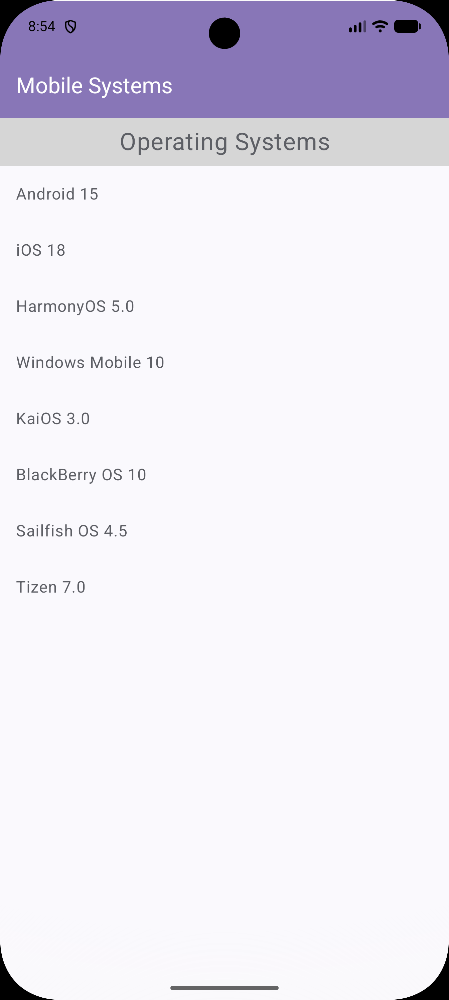

# Mobile Operating Systems

This application shows a list of current mobile operating systems with their versions and links to official websites. The app implements MVI (Model-View-Intent) architecture using Jetpack Compose and Kotlin.

## Screenshots

| Main Screen |
|-------------|
|  |
|  |

## Technologies

- Jetpack Compose — modern UI framework for Android
- Kotlin — primary programming language
- MVI architecture — separation of concerns between layers
- ViewModel — UI state management
- StateFlow — reactive data updates
- Coroutines — asynchronous operations

## Supported Operating Systems

| OS | Version | Link |
|----|---------|------|
| Android | 15 | [android.com](https://www.android.com/) |
| iOS | 18 | [apple.com/ios](https://www.apple.com/ios/) |
| HarmonyOS | 5.0 | [harmonyos.com](https://www.harmonyos.com/) |
| Windows Mobile | 10 | [microsoft.com](https://www.microsoft.com/) |
| KaiOS | 3.0 | [kaiostech.com](https://www.kaiostech.com/) |
| BlackBerry OS | 10 | [blackberry.com](https://www.blackberry.com/) |
| Sailfish OS | 4.5 | [sailfishos.org](https://sailfishos.org/) |
| Tizen | 7.0 | [tizen.org](https://www.tizen.org/) |

## Installation

1. Clone the repository:
```bash
git clone https://github.com/invweb/mobile-operating-systems.git
```

2. Open the project in Android Studio

3. Sync Gradle

4. Run the app

## Architecture

### MVI Module

- **MobileSystemsIntent.kt** - user actions (e.g., load data)
- **MobileSystemsState.kt** - UI state (loading, data, error)
- **MobileSystemsViewModel.kt** - handles intents and manages state
- **MobileSystemsConfig.kt** - systems configuration with resource IDs and URLs

## Development

This project was developed using GigaCode AI assistant by Sber.

## License

This project is created for educational purposes.

## Links

- GitHub: [https://github.com/invweb/mobile-operating-systems](https://github.com/invweb/mobile-operating-systems)
- Android: [android.com](https://www.android.com/)
- iOS: [apple.com/ios](https://www.apple.com/ios/)
- HarmonyOS: [harmonyos.com](https://www.harmonyos.com/)
